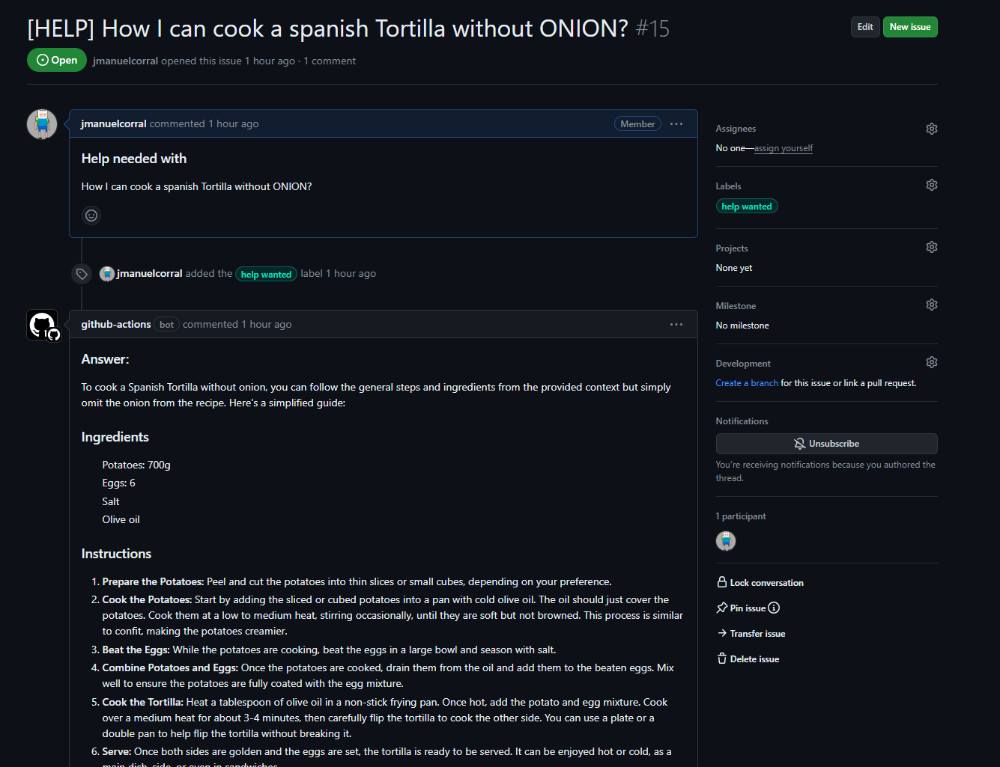
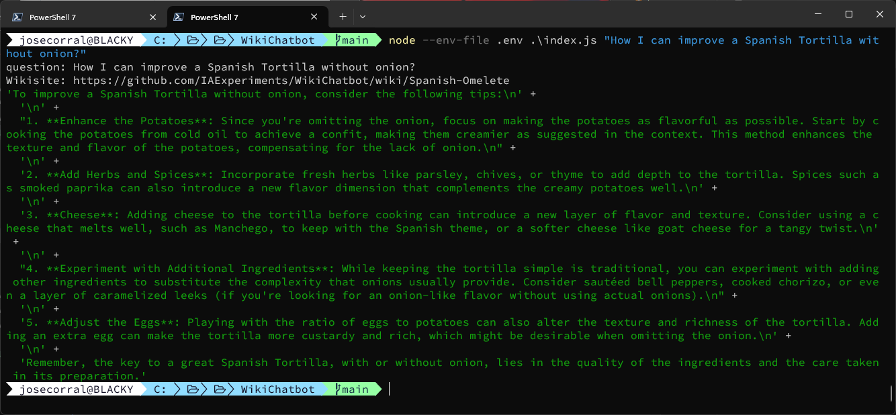

# Wiki Chatbot

An Ai Experiment that consists in a simple LowCost architecture chatbot engine for Wiki pages. It uses wiki pages as a knowledge base and openapi to answer questions.

## Architecture

To maintain simple and didactic the requirements of the architecture, it is simply necessary to have a provisioned deployment of OpenAI on Azure. The system uses the RAG pattern to enrich the context prior to the question. The database for store the chunks of context is an in-memory Vector Database.

### How it works

The application receives a question as input. Scraps the wiki page, split in chunks, calculate the embbedings of this chunks, and hydrates an InMemory Vector Database. Then we ask the question using openai and the RAG pattern. 

### How to run it

You can try to open an issue in the repository with a question. The bot will try to answer it.
The wiki that we are using is the [Spanish Omelete Recipe](https://github.com/IAExperiments/WikiChatbot/wiki/Spanish-Omelete) in the repo.




### How to run it locally

We are using nodejs v20.11.0 in our local development environment (we haven't tested with other versions). To run the application locally, you need to have the following environment variables set, you can set them in a `.env` file in the root of the project or use something like the sample bash exports. The variables are the following:

```bash
export AZURE_OPENAI_API_KEY=your_openai_api_key
export AZURE_OPENAI_API_ENDPOINT=https://yourdeploymentNAME.openai.azure.com/
export AZURE_OPENAI_API_VERSION=2023-03-15-preview
export AZURE_OPENAI_API_INSTANCE_NAME=YourInstanceName
export AZURE_OPENAI_API_EMBEDDINGS_DEPLOYMENT_NAME=Your embeddings deployment name
BASEIMAGEURL=YOUR WIKI URL for render the images
WEBSITE_1=https://github.com/yourUser/YourRepo/wiki
...
WEBSITE_12=https://github.com/yourUser/YourRepoN/wiki

```

Then you can run the application with the following command:

```bash
node index.js "Your question"
```


